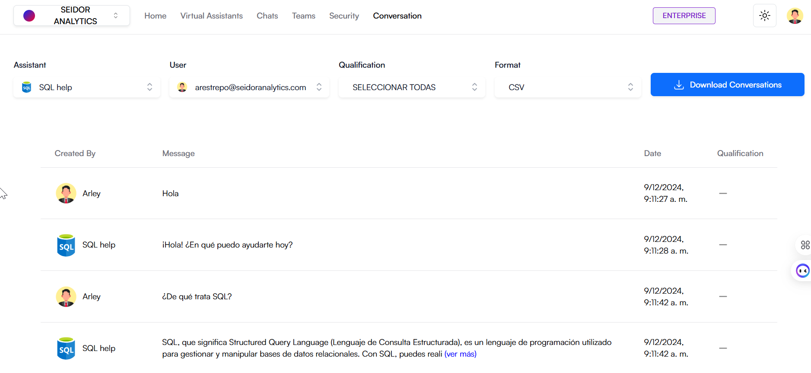

La pantalla de Conversaciones en Daiana permite a los usuarios revisar y gestionar las interacciones realizadas con los asistentes virtuales. Aquí se puede ver el historial de mensajes entre un usuario específico y un asistente virtual, proporcionando una visión detallada de las conversaciones y su contexto.

## **Componentes de la Pantalla**

**1) Barra de Navegación Superior:**

-   **Tenant:** Identificación del Tenant asociado al usuario logueado.
-   **Menú de Navegación:** Incluye las secciones de Inicio, Asistentes Virtuales, Chats, Equipos, Seguridad y Conversaciones.
-   **Indicador de Plan:** Muestra el plan actual del usuario (por ejemplo, Enterprise).
-   **Icono de Tema:** Acceso a los tipos de temas de la plataforma (por ejemplo, Dark).
-   **Perfil del Usuario:** Acceso a las configuraciones de perfil y opciones de usuario.

**2) Selecciones:**

-   **Asistente Seleccionado:** Dropdown que permite seleccionar el asistente virtual con el que se desea revisar la conversación.
-   **Usuario Seleccionado:** Dropdown que permite seleccionar el usuario específico cuyas interacciones se desean revisar.
-   **Calificación Seleccionada:** Dropdown que permite seleccionar la calificación dada a las respuestas.
-   **Formato Seleccionado:** Dropdown que permite seleccionar el formato con el que se descargará las conversaciones.

**3) Historial de Conversaciones:**

**Columnas:**

-   **Creado Por:** Indica quién envió el mensaje, puede ser el asistente virtual o el usuario.
-   **Mensaje:** Contenido del mensaje enviado.
-   **Fecha:** Fecha y hora en que se envió el mensaje.
-   **Calificación:** Opción para calificar la utilidad de la respuesta del asistente (si está habilitado).

## **Procedimientos y Funcionalidades**

**1) Seleccionar un Asistente Virtual:**

-   Utilice el dropdown bajo “Asistente Seleccionado” para elegir el asistente virtual cuyas conversaciones desea revisar.

**2) Seleccionar un Usuario:**

-   Utilice el dropdown bajo “Usuario Seleccionado” para elegir el usuario específico cuyas interacciones desea revisar.

**3) Seleccionar una Calificación:**

-   Utilice el dropdown bajo “Calificación Seleccionada” para elegir la calificación cuyas conversaciones desea revisar.

**4) Seleccionar un Formato:**

-   Utilice el dropdown bajo “Formato Seleccionado” para elegir el formato para descargar las conversaciones.

**5) Revisar el Historial de Conversaciones:**

-   Después de seleccionar los filtros, el historial de conversaciones se mostrará en la tabla a continuación.
-   Puede desplazarse por la lista de mensajes para ver todas las interacciones, incluyendo el contenido, quién lo envió y cuándo.

**6) Ver Más Información:**

-   Para obtener más detalles sobre un mensaje específico, haga clic en “ver más” si está disponible, para expandir el mensaje y ver información adicional.

**7) Calificar Respuestas:**

-   Si la función de calificación está habilitada, puede calificar la utilidad de las respuestas del asistente en la columna de calificación.

**8) Descargar Conversaciones:**

-   Utilice el dropdown bajo “Formato Seleccionado” para elegir el formato para descargar las conversaciones.
-   Clic en el botón que dice “Descargar Conversaciones” para descargar las conversaciones con el formato  anteriormente seleccionado.